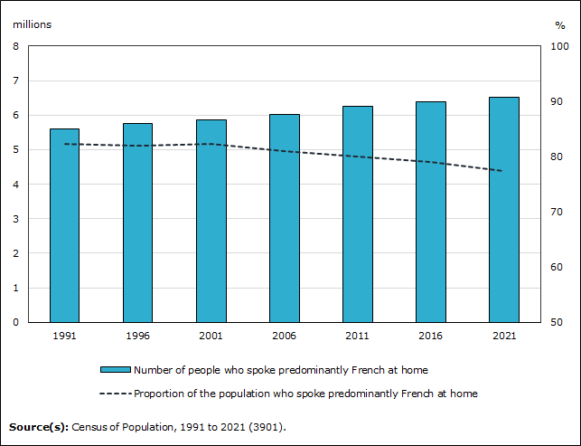
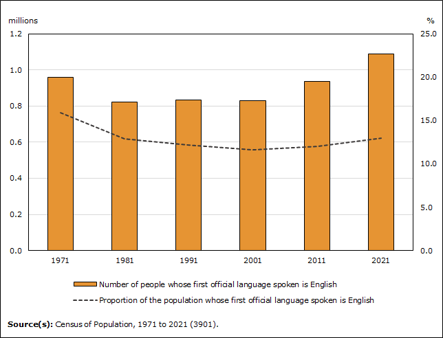
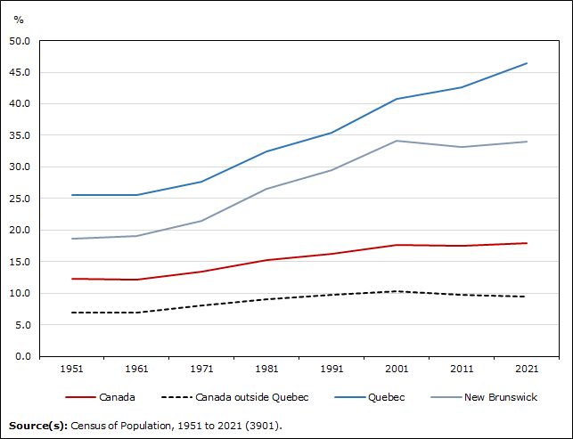
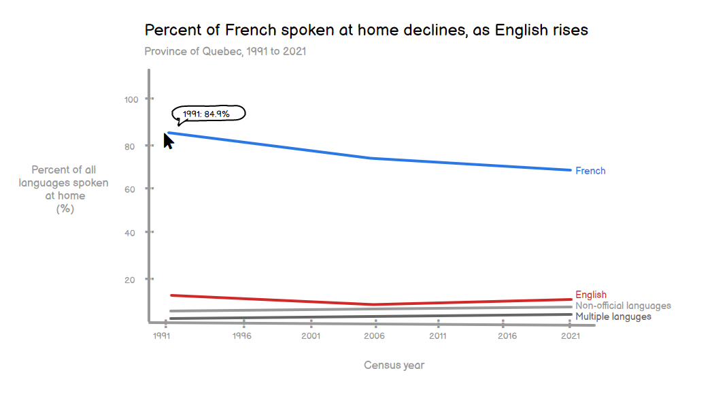
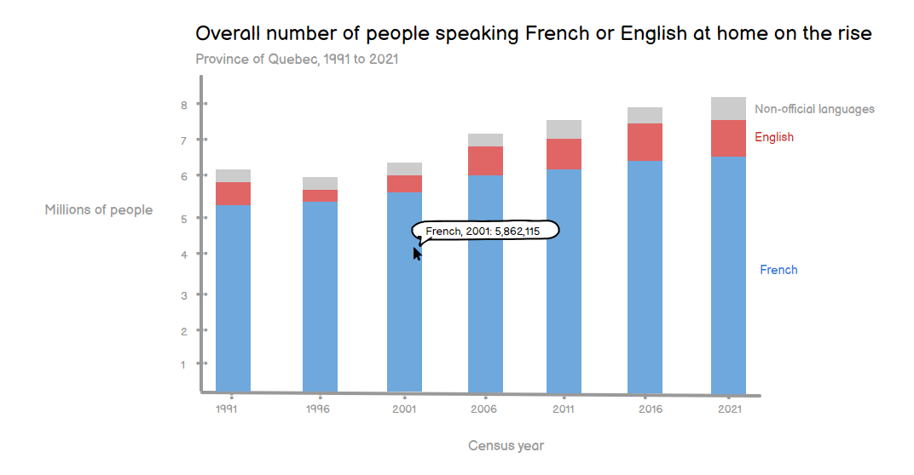

# Assignment: Critique by design, Statistics Canada 2021 Census  
September 20, 2022

## Step 1: Finding a design
For this critique, I chose to review a few of the key charts that Statistics Canada has shared from the recent 2021 census. Language can be a divisive subject in Canada, in particularly Quebec. Canada has two official languages: English and French. In recent years, Quebec has been worried about the increasing number of English speakers in their province. 

The below two charts, are the *main* visualizations Statistics Canada used to communicate the current state of language in Quebec. 

**In Quebec, the relative proportion of individuals who speak predominantly French at home has been decreasing since 2001**

Source: Statistics Canada. (2022). *Infographic 2: In Quebec, the relative proportion of individuals who speak predominantly French at home has been decreasing since 2001*. https://www150.statcan.gc.ca/n1/daily-quotidien/220817/g-a002-eng.htm

**In Quebec, the number of individuals whose first official language spoken is English tops the 1 million mark**

Source: Statistics Canada. (2022). *Infographic 4: In Quebec, the number of individuals whose first official language spoken is English tops the 1 million mark*. https://www150.statcan.gc.ca/n1/daily-quotidien/220817/g-a004-eng.htm

These visualizations were cited in new stories from the [CBC](https://www.cbc.ca/news/canada/montreal/statistics-canada-language-census-2021-1.6553939#:~:text=CBC%20News%20Loaded-,Smaller%20share%20of%20Quebec%20households%20speaking%20French%20regularly%2C%20census%20data,percentage%20points%20in%20five%20years.) and [The Globe and Mail](https://www.theglobeandmail.com/canada/article-proportion-of-french-speakers-in-canada-declines-everywhere-except/) and were also used for analyses by the [Quebec Provincial Government](https://www.oqlf.gouv.qc.ca/ressources/sociolinguistique/2022/Feuillet_Car-ling-pop-Quebec-2021.pdf). 

A third chart, showing bilingualism in Quebec was also communicated, but less widely spread. 

The English-French bilingualism rate has been increasing in Quebec and declining outside Quebec since 2001

Source: https://www150.statcan.gc.ca/n1/daily-quotidien/220817/dq220817a-eng.htm?indid=32989-1&indgeo=0

Right away, looking at these three graphics, I see the claim that French is on the decline and English is on the rise, however bilingualism is also increasing? These contradictory messages prompted me to critique these visualizations, analyze the underlying data, and see if the claim is truly justified or if the visualizations are skewing myself and other reader's perceptions on the decline of the French language in Quebec. This critique is not to deny the fact that French is on the decline in Quebec, but this critique is hoping to understand the true magnitude of the decline in French in Quebec. 

For the scope of this critique, I will only be critiquing and re-designing the first two charts. I wanted to include the bilingual chart to show the root of my curiosity to dig deeper into this discrepincy. 

## Step 2: Critique the data visualization

To critique this design, I will be using the Data Visualization Effectiveness Profile by Stephen Few. 

Few, S. (2017). *Data Visualization Effectiveness Profile*. Perpetual Edge. http://www.perceptualedge.com/articles/visual_business_intelligence/data_visualization_effectiveness_profile.pdf

**Usefulness**: 10

Language is an important part of the Quebecois culture. In recent years, Quebec has been putting forth laws and programs to preserve the French language. Politicians, journalists, and everyday people look towards language demographics as a metric to see if their efforts to preserve the French language are working. 

I graded these charts on Usefulness as a 10 because the information (Number of people speaking French/English and the respective proportion of the population) presented in this chart is a useful indicator of the strength of the Quebecois culture and the impact of programs to preserve French. The effects of these initiatives will be directly reflected in the raw value presented on this chart. 

**Completeness**: 5

I graded these charts in terms of Completeness as a 5. As stated by Few, completeness means that the chart provides enough context to understand the message and context is often shown through comparison. These two charts are normally presented together to be compared, however they show slightly different metrics. The French language chart shows Number of people who speak French at home, while the English language chart shows Number of people with first language English. To be more complete, these charts should show the same metrics to compare. Similarly, these charts are missing information on bi-lingualism or non-official (non-French or English) spoken languages. This information is deeper in the Statistics Canada analysis and forces the reader to seek out these insights themselves.

**Perceptibility**: 4

I rated these charts as a 4 in perceptibility. At first glance, these charts seem simple due to the fact that there is a lot of white space. But, if it were not for the detailed title, the reader may not be able to get the meaning of the chart at first glance. This can be due to the small text on the charts and the use of a two verticle axes. If you are unfamiliar with reaching charts, the dual axes may require you to strain to be able to read the information and take away the intended meaning. 

On the first chart showing French lanuguage, the title is refering to the dotted line showing decreasing proportion, however the natual eye will be drawn first to the blue bars that are increasing in value. This contradiction will force the reader to look closer to take away the meaning. Instead, the chart should highlight the line with an eye-catching color and use grey to push the bars into the background as supporting information. 

Overall, the perceptability on these two charts can be improved by, increasing text size, removing dual axes, and drawing the reader to the element of the chart that matters. 

**Truthfulness**: 5

I rated these charts in Truthfulness as a 5. The claims the titles are making are valid and the data backs up these claims. However, because these charts are communicated together, there is a question of magnitude of these claims. The scales on the two charts are different, however the physical size of the bars are similar in height. As a quick reader, there is the potential to make a speedy concludsion that English is much closer to the number of French speakers in Quebec if you do not notice the differing scales. 

Changing the scale on these charts would help present the data more truthfully and realistically back up the titles' claims. 

Update: I started to sketch out my redesign and I just notices that the horizontal timeline axis are different as well. The English chart has a timeline of 1971 to 2021, while the French chart has a timeline of 1991 to 2021. The skewed timeline inflates the visual increase of English if you do not realize that the charts are showing different timeframes. I would recommend aligning the timeframes of the data and including the time in the title in an effort to truthfully communicate the data to the reader. 

**Intuitiveness**: 5

I rated the charts as a 5 for Intuitiveness. The charts present a good about of information for the reader to understand. After looking at the legend and the chart data, the reader will be able to understand the core insights from the visualization. There may be some difficulty due to the aesthetic design and dual axes, but within a few seconds, the reader should be able to get the message. By improving the font size and removing the dual axes, these charts would become more intuitive. 

**Aesthetics**: 3

I rated the aesthetics of these visualizations as a 3. These charts are both bar graphs with similar sizing bars and tiny text. Besides the color of the bars, there is nothing eye-catching about these charts that will draw a reader in. As discussed prior, increasing the font size of the charts and aligning the vertical axis scale will draw the reader into the charts and provide more dynamic levels to present the information. The charts are not fully ugly, however they are not pleasing to the eye and definitely not beautiful. 

**Engagement**: 2

The engagement of these charts is low. The visualization is not distracting from the data, but it does not draw the reader into view the data for reasons described in the Aestentics section. The charts could be made more engaging if the reader was able to hover over the data and see the underlying values of the chart elements. The raw values are written in text in the article underneath the chart. Adding this small, interactive element would make the chart more truthful and engaging.

Overall, these two visualizations are neither unreadable nor unusable, they communicate the information they hold in a straightforward manner. However, there are two elements that give me pause that make these visualizations hard to compare, even though these two visualizations are commonly shown side by side in news articles and media.

Critique technique source: http://www.perceptualedge.com/articles/visual_business_intelligence/data_visualization_effectiveness_profile.pdf

### Describe your overall observations about the data visualization here.  What stood out to you?  What did you find worked really well?  What didn't?  What, if anything, would you do differently?

The first difference is that the values are showing two different metrics: Number of people who speak French at home vs. Number of people whose first language spoken is English. It's a slight difference between the terminology of these metrics, but as a reader it can be confusing to understand these definitions and differences between the values. Secondly, while these charts are often shown together, their axis have different scales. At a quick glance, a reader may not see the different scales and attribute a larger increase in English language and a smaller decrease in French.

I do like that these charts are trying to stay simple. There is not too much text on the charts and there is a lot of white space, allowing the reader to be able to piece together the puzzle of what the are trying to convey. Similarly, each of these charts have great descriptive titles that guys the reader to interpret the data rather quickly.

Overall, the things I would change are:
- Use the same metric for both English and French to compare apples to apples.
- Have the same axis scales (vertical and horizontal). To really compare the values, the axis scales should be the same to visually see a realistic picture.
- Remove the double axis. Potentially, using a stacked bar chart to show the entire population compared to the French population may be a good way to show the raw count but allow the reader to get an idea of the proportion of the population without using a second axis.

I would keep:
- White space. I would want to keep the graph easy to read and not over cluttered.
- Descriptive title. This is a great tool to guide the reader towards the insight from the graph.

### Who is the primary audience for this tool?  Do you think this visualization is effective for reaching that audience?  Why or why not? 
The audience of this visualization is the general Canadian population. Journalists and statisticians will be the primary consumers of this visualization, but as Statistics Canada is the federal government's data arm, they should prepare for anyone in the general population to view this information. Those who are particularly interest in the language demographics of the population will also pay close attention to this visualization. I do not think this visualization is effective in communicating to such a broad audience who may or may not be familiar with reading charts. For example, the double vertical axis is a feature that is more geared to readers who are used to reading visualizations. If you are unfamiliar with how a double axis works, this may be confusing to read. Similarly, the text on these charts is extremally small and may be hard to read for people who poor eyesight. Using one axis per chart and having larger text to improve legibility are some things that can be improved on the visualization to become more accessible to the entire Canadian population.

### How successful what this method at evaluating the data visualization you selected? Are there measures you feel are missing or not being captured here?  What would you change?  Provide 1-2 recommendations (color, type of visualization, layout, etc.)

I liked this way of critiquing, but there were a few categories that I felt overlapped. The Perceptibility and Truthfulness categories have some similar concepts that involve if the visualization is correctly displaying the data to the reader. I find that an imperceptible graph my lead to untruthfulness. I had a hard time clearly differentiating these categories and would maybe change the perceptibility category to be more reflective of the "ease to understand the main point".

## Step 3: Sketch out a solution
I produced the two below charts as a first initial sketch of the redesign using Balsamiq wire framing tool:

Source: Statistics Canada, Census Data 1991-2021

Source: Statistics Canada, Census Data 1991-2021

## Step 4: Test the solution

### Interview 1: Arts student, mid-20s, lives in US

For this interview, I went through each chart separately. 

#### Chart 1
- Can you tell me what you think this is? 
Umm, a graph showing the change... Okay, this is confusing. Okay, the change in the percentage of households that speak French at home vs english and other language. And it looks like over time French decrease, and English decreased and rose again.

- Can you describe to me what this is telling you? 
It tells me that French is still a majority primary language in Quebec household, but English seems to be getting more popular vs 30 years ago. 

- Is there anything you find surprising or confusing? 
I'm confused about, I don't understand the percent of all languages spoken at home, households or people? Thats confusing. The scale is also confusing, I can't tell if English is really rising or not. 

- Who do you think is the intended audience for this?  
Different quebec govt agencies. Or quebec residents who are curious about what language their neighbors are speaking. 

- Is there anything you would change or do differently?  
The scale is hard to interpret change, everything seems very condensed. Maybe a secondary axis? Specify specifically how percent of all languages spoken at home is calculated.

#### Chart 2
- Can you tell me what you think this is? 
I like this one better. This is looking at the past 30 years and how the number of people speaking languages in quebec has changed over time according to census data. 

- Can you describe to me what this is telling you? 
 It tells me that French speakers has been consistently increasing. English has fluctuated a bit but overall is increasing, but French every year is the majority. 

- Is there anything you find surprising or confusing? 
Is this like primary language at home, is it both? Are people double counted? I'm not surprised. 

- Who do you think is the intended audience for this? 
Same. 

- Is there anything you would change or do differently? 
Maybe a horizontal bar chart? Im not sure!

- Asthetics? 
Colors are contrast its good. I like that I can hover over to see numbers, that will help with scale. 

### Interview 2: Medical student, mid-20s, lives in Quebec

For this interview, I presented the charts together.

- Can you tell me what you think this is? 
It's a graph showing the amount of different languages spoken at home as a function of time. 

- Can you describe to me what this is telling you? 
Start with one on the left: Mostly that French is going down and the other languages aren't really changing. 
Second chart: It shows the number of people language is on the rise. It's not a good graph because you can't tell the reason as to why these changes are happening. Did the census reach more people, did the population increase? It seems like their all on the rise, which implies the population is growing, but that's not explicitly stated. Hard to tell the rates, the change year over year. This graph is worse at showing the change year over year, I see its increasing, but how much. 

- Is there anything you find surprising or confusing? 
If I didn't know about your project, I wouldn't know that it was Quebec. Quebec should be in the title. It doesn't seem like the % add up to 100%. Font needs to be bigger for the axis. 

- Who do you think is the intended audience for this? 
I feel like they'd both be for a different audience. Left = Quebec separatists, pro francophone who think we're losing our culture. Right = The opposite? Not sure. I think they are painting opposite stories. Most people aren't going to take the time and realize its percentage of population. Where is this from? I don't see that its census data. 

- Is there anything you would change or do differently? 
The graph on the left has so much empty space. If the point is to exacerbate the difference then it works. Potentially an area chart? It could be good to highlight why there is an inflection point. 

A imitation with Balsamiq is that I ca only put one dent in a line. This was bad for reflecting non-linear lines and testing. The test interviewees were trying to make sense of the data, however the data wasn't fully accurate. 

### Key takeaways from the interviews

- Larger text
- Clearly state Quebec and time in the title
- Consider merging the charts. Can we compare languages and show increasing population, but decreasing change in percentage in one visualization 
- Clarify the metrics with more descriptive axis and titles so that reader isnt confused as to if people are counted twice. 

## Step 5: Build the solution

My final solution are the two charts that follow: 

Instead of doing growth rate, I also have this chart to display the percent of population change between 1991 and 2001. 

I decided to focus on showing the contradiction between the French-speaking population growing, but at a slower rate than the other languages over the macro-trend of 30 years. 

The first chart shows that French is still dominant to other languages, however all languages and population are growing over the past 30 years. While, the second chart gives the overall growth rate of languages spoken at home between 1996 and 2021. 

The insights from these two charts contradict each other, which caused confusion in my interview. I hope that these charts give a realization rather than confusion to the reader that French is slowing down growth, but it still is growing. 

I decided to show only 4 years of census data, each a decade a part to focus on the macro, decade-over-decade trend.  

I struggled with the title of these charts. Communicating how the metrics are calculated, the location, and timeframe all in one sentence is a challenge. These charts are not perfect and still need improvement, however I hope they give a bit more understanding of the language situation in Quebec. 

## Sources

Statistics Canada. [Table 98-10-0200-01  Language spoken most often at home by other language(s) spoken regularly at home: Canada, provinces and territories, census metropolitan areas and census agglomerations with parts](https://www150.statcan.gc.ca/t1/tbl1/en/tv.action?pid=9810020001)

Statistics Canada, 2016 Census of Population, Statistics Canada Catalogue no. 98-400-X2016075. 

Statistics Canada, 2011 Census of Population, Statistics Canada Catalogue no. 98-314-XCB2011042.

Statistics Canada. (2006). _Population by language spoken most often at home and age groups, 2006 counts, for Canada, provinces and territories - 20% sample data_. https://www12.statcan.gc.ca/census-recensement/2006/dp-pd/hlt/97-555/T402-eng.cfm?Lang=E&T=402&GH=4&SC=1&S=99&O=A

Statistics Canada, 2001 Census of Population, Statistics Canada Catalogue no. 97F0007XCB2001003.

Statistics Canada, 1996 Census of Population, Statistics Canada Catalogue no. 93F0024XDB96003.

Source: Statistics Canada, 1991 Census of Population, Statistics Canada Catalogue no. 93F0024XDB96003.

