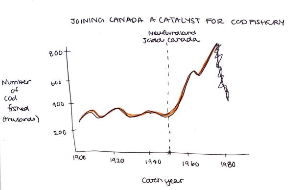
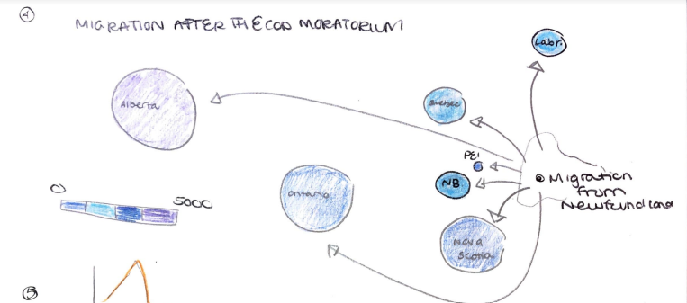

# Final Project: Visualizing the Impact of the Cod Moratorium on Newfoundland

Kelly McManus

September 26, 2022

For my final project, I hope to warn and educate of the negative impacts technology can have on our society through the story of the cod fishery in Newfoundland, Canada. The cod fishery was the center of Newfoundland economic and cultural society for hundreds of years. After joining Canada and the commercialization of the fishery in 1949, the waters of Newfoundland were overfished and depleted of cod. The cod population plummeted leading the government to call a moratorium on the cod fishery in 1992 resulting in economic decline, migration and relocation, and a loss of culture for the Newfoundland people. 

## Outline & sketches

**High-level summary**: Technology and economic security are great until it takes all your fish and you are forced to leave your home. 

**User stories**: 
- As a reader, I want to know the mistakes of the past, so that I can vote/make better decision in the future. 
- As a reader, I want to know how to protect my culture so that my kids can grow up in a world like me. 

**Call to action**: 
- I can do this by voting for politicians who support local industry. 
- I can do this by buying from local/non-commercial companies. 

**Storyboard**

### Setup 
_Takeaway: The fishery is a huge part of Newfoundland culture and economy._ 

- Early 1900s, Newfoundland was struggling as an independent country
  - Map: Point on Newfoundland, Canada.
  
- In 1949, they decided to join Canada for economic security
- Canada realized the economic opportunity Newfoundland had with its cod industry. They invested in expanding and commercializing the industry. 
  - Chart: Line chart with number of cod commercial companies in Newfoundland increases dramatically after 1949. X = years. Y = number of cod commercial companies.
  
- However, the thriving commercial cod fishery was too effective...

### Conflict
_Takeaway: The decline of the cod fishery due to commercialization had a negative impact on lives of Newfoundlanders._

- Poor regulations and IUU led to a drastic depletion in the cod industry.
  - Chart: Increase of IUU fishing citations in the late 1900s.
  - Title = Fishing citations dramatically increase before and after the moratorium
  
- The Canadian government shut down the commercial cod industry with a cod moratorium in 1992 as a last resort option to save the cod population.
  - Chart: Same cod-population chart, but vertical even indicator of the cod moratorium in 1992.
  
  - Cod is "vulnerable to extinction" 
    - Source: https://oceana.org/marine-life/atlantic-cod/#:~:text=Scientists%20agree%20that%20North%20Atlantic,currently%20considered%20vulnerable%20to%20extinction.
- The death of the cod fishery forced people to leave their homes and move away.
  - Map: Arrows connecting Newfoundland to other provinces indicating the number of people who moved away from Newfoundland in the 1990s.
  - Title = Migration after the cod moratorium  
    
  - Title = With no cod left, Newfoundlanders migrate away to find a new home 
  
- It's not just the cod fishery, this has happened in other industries and places like...

### Resolution
_Takeaway: Buying from local companies and voting for politicians who support local industry will help solve this problem._

- Similar stories have occurred: Climate change and the irreversible damage done to the planet by human pollution 
- There are things we can do in our local communities to prevent unnecessary harm to our culture and societies due to unregulated commercialization.  
  - Support local fisherman. 
  - Buy local seafood and products.

## Data and sources

This project will incorporate a number of complementary datasets to tell the story of Newfoundland's cod industry. 

- Northern cod yearly catches, 1508-2019   

    This dataset displays yearly cod catches for the past five centuries. Catches are often used as an estimate for fish population as it is impossible to track the total number of fish in the ocean. The dataset was constructed from two separate sources, NAFO annual reports and DFO stock status updates, for the Journal of Marine Science and was published in 2021. The dataset is publicly accessible in the supplementary data of the article.   

    Rebecca Schijns, Rainer Froese, Jeffrey A Hutchings, Daniel Pauly, Five centuries of cod catches in Eastern Canada, ICES Journal of Marine Science, Volume 78, Issue 8, November 2021, Pages 2675–2683, https://doi.org/10.1093/icesjms/fsab153   

- Newfoundland population, 1971 to 2021   

  This dataset displays Newfoundland's yearly population between 1971 and 2021 from Statistics Canada. The data will be used to compare similar trends between fluctuation in yearly cod catches and the Newfoundland population.   

  Statistics Canada. Table 17-10-0005-01  Population estimates on July 1st, by age and sex, https://doi.org/10.25318/1710000501-eng   

- Newfoundland migration   

  Along with population data, viewing the yearly migrations of people out of Newfoundland will also help to tell the story of the negative impact the cod moratorium had on the province. This dataset displays the number of people that moved from Newfoundland to another Canadian province each year. I hope to present a map that visually represents the geographic relocation of Newfoundlanders due to the cod moratorium.   

  Statistics Canada. Table 17-10-0022-01  Estimates of interprovincial migrants by province or territory of origin and destination, annual, https://doi.org/10.25318/1710002201-eng   

- Post-joining Canada: Economic impact metrics   

  Newfoundland was its own country until 1949 when it joined Canada. Finding data on Newfoundland before it was a part of Canada can be hard. One metric that Canada uses to track long-term economic performance is household income per capita. I will be using this data to analyze the economic impact of joining Canada and the cod moratorium on Newfoundland.   

  Statistics Canada. Table 36-10-0229-01  Long-run provincial and territorial data
  DOI: https://doi.org/10.25318/3610022901-eng   

- Increase in fishing citations around moratorium   
  
  This dataset shows the number of citations given to fishing boats during the period of 1984-2004. It is hard to quantify IUU (illegal, unreported, and unregulated) fishing, but we can use the citations somewhat as a proxy for these values. I say somewhat because there has been a lot of critism that the government did not properly enforce the fishing regulations which contributed to the cod moratorium. We can take away from this data that there are a lot of illegal fishing activities and many were not caught until the cod moratorium.    

  Chair, A.W. (2006). _Breaking New Ground: An Action Plan for Rebuilding
  The Grand Banks Fisheries_.  Sustainable Management of
  Straddling Fish Stocks in the Northwest Atlantic. https://www.gov.nl.ca/ffa/files/publications-archives-pdf-breakingnewgroundadvisory2005.pdf

## Method and medium

The main medium for the project will be Shorthand. I believe the flow of the story along with the complementary graphs will be best communicated in an online article format with Shorthand. Having a shareable link will also be nice to have to easily share the Shorthand website with anyone who may be interested. 

## More sources 

- Cod history: https://oceana.org/marine-life/atlantic-cod/#:~:text=Scientists%20agree%20that%20North%20Atlantic,currently%20considered%20vulnerable%20to%20extinction. 
- Inter-provincial migration: https://doi.org/10.25318/1710002201-eng
- Net migrants: https://stats.gov.nl.ca/Statistics/Topics/population/PDF/Interprov_Mig_Census_Year.pdf
- https://www.stats.gov.nl.ca/Publications/Historical/PDF/Historical_Statistics_of_Newfoundland_and_Labrador_V2_N7_1994.pdf
- https://academic.oup.com/icesjms/article/78/8/2675/6359257#323429971
- https://datacommons.org/tools/timeline#place=wikidataId%2FQ2003&statsVar=Count_Person&chart=%7B%22count%22%3A%7B%22pc%22%3Afalse%2C%22delta%22%3Afalse%7D%7D
- https://datacommons.org/place/wikidataId/Q2003?utm_medium=explore&mprop=count&popt=Person&hl=en 
